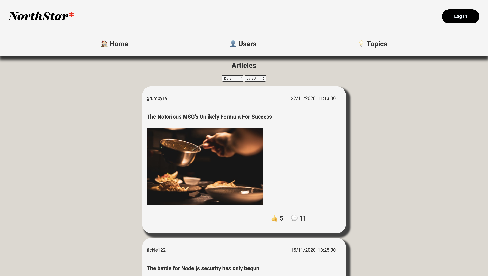
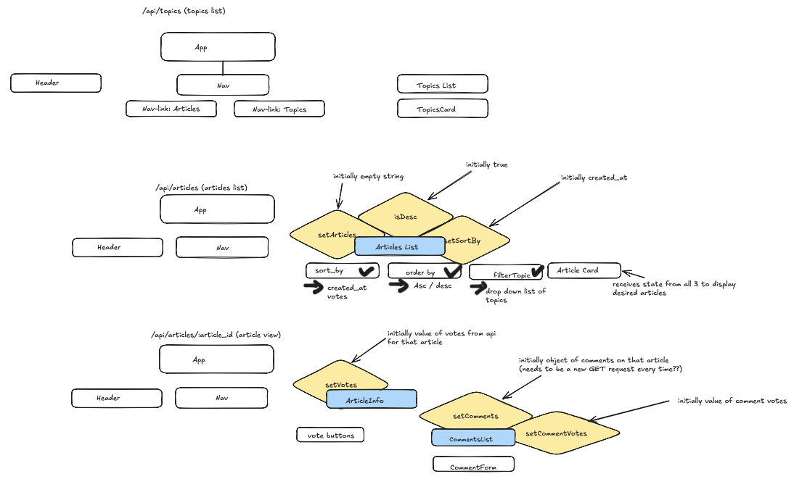

# NorthStar\* (formerly NC News Front End)

## Table of Contents

- [About](#-welcome)
- [Getting Started](#getting-started)
- [Hosting](#hosting)
- [API Interaction (Connecting to the Back End)](#api-interaction-connecting-to-the-back-end)
- [Documentation](#documentation)
  - [State Management](#state-management)
  - [Custom Hooks](#custom-hooks)
- [Features](#features)
- [Reflections](#reflections)
- [Credits](#credits)

## About

NorthStar\* is a news-application-style Front End SPA that provides a user-friendly interactive display using the API [nc-news-be](https://github.com/J-Mro/nc-back-end), providing the hottest topics and articles.

Please view the current deployed version [here](https://incomparable-mandazi-0d1bc1.netlify.app)!

This project was created using node v25.2.1, React v19.2.0 and Vite v7.3.1. Please note that earlier versions may not work for this application.

## Getting Started

Before starting, Open a terminal (Command Prompt or PowerShell for Windows, Terminal for macOS or Linux) and ensure Git is installed
(Visit https://git-scm.com to download and install console Git if not already installed).

To install this project for your own purposes, please carry out the following steps by running these commands in your terminal:

1. Clone this repository

   ```
   git clone https://github.com/J-Mro/nc-back-end
   ```

2. Navigate to the repository on your local machine

   ```
   cd nc-news-fe
   ```

3. Install project dependencies (see package.json for a list of dependencies)
   ```
   npm install
   ```
   You should now be ready to start setting up your databases.

## Hosting

NorthStar\* can be built and hosted locally using Vite. In the `package.json`, there are npm scripts that will run vite commands for you.

Open a terminal in your code editor of choice and run the following command to host your app locally in your browser:

```
npm run dev
```

After running this, you should see something like this in your terminal, which you can click on to view a locally hosted version of this application:

```
Local: http://localhost:5173/
```

To build a production version of this app, execute the following command:

```
npm run build
```

## API Interaction (Connecting to the Back End)

To interact with the data from NC News Back End, please ensure that this API is set up before continuing on. If you would like to host the API locally, please find the necessary set up in the README [here](https://github.com/J-Mro/nc-back-end).

This application makes use of CRUD requests carried out via Axios to the [hosted API URL](https://nc-back-end.onrender.com/). I opted to use axios instead of fetch for its readability, and because it automatically serialises request bodies into JSON format. You can find more information about axios in the documentation [here](https://axios-http.com/docs/intro).

These requests are currently carried out through 7 util functions designed to do a different task along a specified endpoint (e.g. posting a comment to a specific article). You can find these in the `./public/utils/` directory.

Once you're connected, you should see a landing page that looks something like the image below:



## Documentation

### Features

Below is a list of features available when you've got NorthStar\* and NC Back End set up:

- View a list of available articles and filter them by Date and Likes via the drop-down lists. This is also the landing page, and can be accessed either by clicking "🏠 Home" in the Nav bar or "NorthStar\*"
- View a single article by clicking on its card or entering `/articles` after the URL
- View a list of topics by navigating to "💡 Topics" in the Nav bar or entering `/topics` after the URL
- View a grid of users by navigating to "👤 Users" or entering `/users` after the URL, or by clicking the "Log In" button on the top right
- Log-in as a particular user by clicking on their picture
- View who is logged-in in the right of the header
- View a list of comments on articles by clicking on an article card and scrolling to the bottom of the page

### State Management

In this section we will discuss how I have stored state in this application.

Below is a rough outline of my original component tree. For navigational ease I have created the following key:

- _Component with no state stored_: white rectangle 🏳️
- _Component with state_: light blue rectangle 🩵
- _State_: yellow diamond 💛
- _Drop-down list_: black V shape ✔️
- _Drop-down list options_: black arrow pointing right (beneath components with a drop down list) 🖤

For component relationships:

- a child component is represented as being underneath its parent
- sibling components are in the same line, directly next to each other

Note that different views (or pages) have serparate component trees and are distunguished by the API routes that they represent and fetch data from (e.g. /api/topics is a list of topics available on NC News Back End).



Each state makes use of the React library's useState hook, which returns an array containing the current state value and a setState function that is used to update state. Coupled with one of React's other hooks, useEffect, which takes a dependancy array as an one of its arguments, adding state to this array will trigger a re-render of the component that state is stored in as well as all of its child components when that state has been updated.

Let's consider sorting by date as an example. This is one of the options in the drop down list "sort by". Clicking the option "Date" in the drop down list triggers a re-render of the "Articles List" component as as well as all of its child components.

### Custom Hooks

Due to the asynchronous nature of communicating with the back end API, data can take time to load. Bad requests to the API, or invalid routes can also lead to errors on the front end that would result in a poor user experience without proper handling. For these reasons, as well as the frequency of which it is done in this application I have implemented a custom hook `useLoadingError` that can be found in `./src/hooks`.

This hook is a function that takes 2 arguments:

- `reqFunction` : the request function (a CRUD request made within one of the util functions in `./src/utils`).
- `options` : an object with 2 properties
  - `dependencies` : state variables that are passed to the dependency array. These will trigger a re-render of the component where that state is stored (and its children) if that state is updated.
  - `params` : arguments passed to `reqFunction` (albeit with a confusing name).

This custom hook stores 3 states:

- `data` : the data received (intially `null`),
- `isLoading` : the current loading state (initially `true`),
- `error` : the error received in the even , the works with an async function `setUp` that is defined in the callback argument of the `useEffect` hook used as part of `useLoadingError` (intiailly `null`),

and returns an array of the form `[data, setData, isLoading, error]`.

Within the `useLoadingError` hook body, React's `useEffect` hook is invoked with a callback function and a dependency array that contains `...dependecies`. This callback function calls an async function `setUp` that sets the `isLoading` state to `true` then uses a `try/catch/finally` to attempt to make a CRUD request to the NC News Back End API, updating the `data` state in a successful case or the `error` state if something goes wrong. In any case, `isLoading` is set to `false`. The component `useLoadingError` has been called in can then interpret the return value and display a more desireable result to the user in the case of loading data and error handling.

## Reflections

This was a 10-day project was to create a complimenatry Front End SPA to the [NC News Back End API](https://github.com/J-Mro/nc-back-end) whilst completing the Northcoders Software Development with AI Bootcamp.

My main takeaways from this project were:

- an understanding of how front end applications can interact with APIs
- a deeper understanding of how React apps are constructed
- an improved understanding and appreciation of proper planning and clearly defined user stories
- an appreciation of how storing state as low as possible is beneficial not only for optimisation but for user experience

## Credits

This portfolio project was created as part of a Digital Skills Bootcamp in Software Engineering provided by [Northcoders](https://northcoders.com/).
